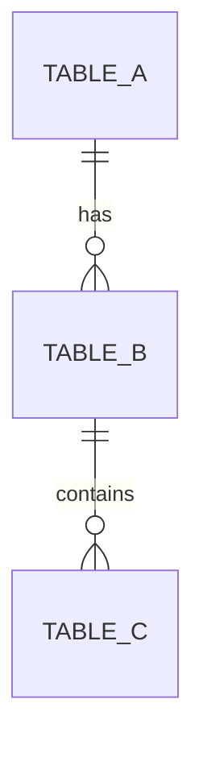

# 03 · 資料模型與資料字典 (As-Is)

> **目的**: 逐欄字典 + ERD, 讓 DBA / 資料工程接手不會問「這欄什麼意思」。
> **撰寫日期**: YYYY-MM-DD

---

## 1. 來源系統詞彙表

| 詞彙 | 系統慣用 | 實際意義 | 備註 |
|---|---|---|---|
| | | | |

## 2. 核心表逐欄字典

### Table: `[table_name]`

| 欄位 | 型別 | 用途 | 範例值 | 來源 |
|---|---|---|---|---|
| id | | | | |
| ... | | | | |

**索引**:
- `[idx_name]`: [欄位], [用途]

**觸發器 / 約束** (若有):
- `[trg_name]`: [做什麼]

## 3. ERD

## 4. 命名反模式 (現況踩坑)

- ❌ `[bad_col_name]` — 應該叫 `[good_name]`, 但改名成本高, 已認命
- ❌ `[bad_pattern]` — 未來新表別學

## 5. 資料權責

| 表 | 誰寫 | 誰讀 | SLA |
|---|---|---|---|
| | | | |
