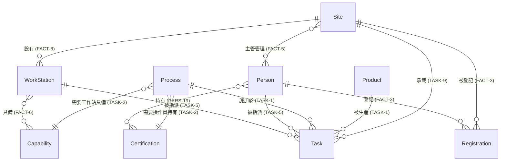

# 軟體設計文件（SDD, Software Design Document）：FMS_V2

**Factory Management System — Python / Django 版** ｜ v1.0（2026-08-25）

> **這份文件回答「怎麼做」。** 「要滿足什麼」見 [`SRS.md`](SRS.md)——那份是驗收依據，
> 本檔是為了滿足它而選定的設計。教學材料（里程碑、踩坑地圖）見 [`GUIDE.md`](GUIDE.md)。
>
> **SRS 與 SDD 的分工**：SRS 實作中立（換技術棧仍成立），SDD 綁定技術棧。
> 本檔每一節都應能回答「這是為了滿足哪一條 TECH/FACT/TASK/PERS/ACC」。

| | 全名 | 內容 |
|---|---|---|
| [SRS.md](SRS.md) | Software Requirements Specification | 需求（做什麼）——逐條驗收 |
| **SDD.md**（本檔） | **S**oftware **D**esign **D**ocument | 設計（怎麼做）——UI 版型與部署 |
| [GUIDE.md](GUIDE.md) | Course Guide | 教學（怎麼學）——里程碑、踩坑、Demo |

## 目錄

| § | 內容 | 對應需求 |
|---|---|---|
| 1 | UI 版型規範（AdminLTE） | TECH-6, ACC-5 |
| 2 | Docker Compose 部署規格 | TECH-13, ACC-7 |
| 3 | 資料模型（ER 圖） | FACT-1~7, TASK-1~2 |

> **V2 的設計文件比 V3 短很多，這是刻意的。** Django 的「約定優於配置」把大量
> 設計決策內建了（ORM、admin、forms、認證），不需要你逐一決定；V3 走顯式契約路線，
> 每一層都要自己接，所以 SDD 長得多。**兩份 SDD 的厚度差距，本身就是這門課要教的事。**

---

## 1. UI 版型規範（AdminLTE）

採 **AdminLTE 3.2**（Bootstrap 4.6 底；資產放 `static/lib/adminlte/`，離線可用、不依賴 CDN）。
所有頁面套同一版型，**不得混用其他 CSS 框架**：

| 區塊 | AdminLTE 落法 |
|---|---|
| 整體版型 | 標準 Admin 版型：頂部 `main-header navbar` + 左側 `main-sidebar sidebar-dark-primary` + `content-wrapper` |
| 左側選單 | `nav-sidebar` 依角色分群渲染（Django template 依 `request.user` 角色判斷）：任務排程（主管）／我的班表（操作員）／公開看板（所有人）／系統管理（僅管理員，連 Django admin） |
| 側欄底部 | 登入者姓名＋角色＋所屬據點；登出連結 |
| 內容區 | 一律用 `card`（`card-header` 放標題與工具鈕、`card-body` 放表格/表單）；清單用 `table table-striped table-hover` |
| 頁內分類切換 | `nav nav-pills`（膠囊式，不用底線 tabs） |
| 登入頁 | AdminLTE `login-page` + `login-box` 版型（置中卡片；錯誤訊息具體但不揭露帳號是否存在） |
| 狀態顯示 | 任務狀態以 `badge` 呈現：In Planning=`badge-secondary`、Scheduled=`badge-primary`、Finished=`badge-success` |
| 表單驗證 | Django form errors 對接 Bootstrap `is-invalid` + `invalid-feedback`（TECH-10 清楚錯誤訊息） |
| RWD | 沿用 AdminLTE 內建行為：窄屏側欄自動收合為抽屜（漢堡鈕） |

> 選配：品牌主色可覆寫為鋼藍 `#2E6DA4`（自訂一支 `custom.css` 覆蓋 `.btn-primary`/
> `.sidebar-dark-primary .nav-link.active`），非必要項。

## 2. Docker Compose 部署規格（TECH-13）

單機（Docker Desktop）、單服務即可：

```yaml
# docker-compose.yml
services:
  web:
    build: .                       # Dockerfile：FROM python:3.12-slim
    ports: ["8000:8000"]
    volumes:
      - ./data:/app/data           # ★SQLite 檔放 volume——容器重建資料不丟
    command: sh -c "python manage.py migrate && python manage.py runserver 0.0.0.0:8000"
```

```dockerfile
# Dockerfile（離線 build：不打 PyPI；uv 由官方映像 COPY 進來，不走網路安裝）
FROM python:3.12-slim
# uv 二進位（單一執行檔，無相依）——教室機需先 docker load 這個映像
COPY --from=ghcr.io/astral-sh/uv:latest /uv /usr/local/bin/uv
WORKDIR /app
COPY wheels/ wheels/
COPY pyproject.toml uv.lock requirements.txt ./
# --offline：確保 build 期零外網;命中不了 wheelhouse 就讓它失敗,不要偷連 PyPI
RUN uv pip install --system --offline --no-index --find-links wheels/ -r requirements.txt
COPY . .
```

**規範**：
1. `settings.py` 的資料庫路徑指向 `/app/data/db.sqlite3`（volume 內），**禁**放容器層。
2. **離線三件套**：基底映像預載（`docker save python:3.12-slim ghcr.io/astral-sh/uv:latest
   -o base.tar` → 教室機 `docker load`）＋ **uv wheelhouse**（`wheels/` 進 build context，
   由 `uv.lock` 匯出）＋ `static/lib/` 已 vendor——三者齊備即可斷網
   `docker compose up --build`。
   > 為何用 uv 而非 pip：`uv.lock` 鎖定**跨平台可重現**的完整相依樹（含 hash），
   > 三十位學員機器還原出的環境一模一樣;`uv sync` 亦比 pip 快一個量級，
   > 教室現場等待時間差很有感。
3. 課程接受 `runserver` 於容器內作為交付形態（單機教學用）；改 gunicorn 列加分項。
4. 驗收指令即文件：README 須含「`docker load` → `docker compose up -d` → 開
   `http://localhost:8000`」三步，照打即通（ACC-7）。

---

## 3. 資料模型（ER 圖）

下圖是**依需求推導**的實體關係，欄位為示意（實際型別與約束由你決定）。
關鍵在**關係的多重性**——那是 FACT/TASK 條文的直接翻譯。
**V3 版是同一張圖**（需求相同），差別只在實作載體。



**主要欄位**（示意；實際型別與約束由你決定）：

| 實體 | 欄位 | 對應需求 |
|---|---|---|
| `Site` | `id` PK、`name` | FACT-1 |
| `Person` | `id` PK、`first_name`、`last_name`、`email` UK、`password`、角色 | PERS-1, PERS-2 |
| `Product` | `id` PK、`name` | FACT-4（不可硬編碼） |
| `Process` | `id` PK、`name`、`certification` FK、`capability` FK | TASK-2 |
| `Certification` | `id` PK、`name` | TECH-11（不可硬編碼） |
| `Capability` | `id` PK、`name` | TECH-11（不可硬編碼） |
| `WorkStation` | `id` PK、`site` FK、`name` | FACT-6 |
| `Registration` | `id` PK、`person` FK、`site` FK、`year`、`week` | FACT-3、FACT-2（ISO 8601，week 1~53） |
| `Task` | `id` PK、`site` FK、`product` FK、`process` FK、`operator` FK、`work_station` FK、`year`、`week`、`starts_at`、`ends_at`、`status` | TASK-5/8/9、FACT-7、TASK-7 |

**讀圖重點（這三個是設計的核心，不是裝飾）**：

1. **`Process` 是樞紐。** 它同時指向一張證照與一項能力——這一條讓 TASK-3（能力匹配）
   與 TASK-4（證照檢查）變成「查兩個 FK 是否對得上」，而不是散落各處的 if。
2. **兩個多對多**：人↔證照、工作站↔能力。Django 用 `ManyToManyField` 即可
   （會自動建中介表）；**不要**在人員 model 塞一個 `certifications` 字串欄位。
3. **`Registration` 是 PERS-11 的守門員。** 指派任務前必須查得到
   「該操作員 × 該據點 × 該週次」的登記——沒登記就不能被指派。

### Django 實作提示

| 需求 | Django 落法 |
|---|---|
| `Person`（PERS-1/2 以 email 登入） | 自訂 `AbstractUser`（`USERNAME_FIELD = 'email'`）**或** `User` + `Profile`；**開工就要決定**，中途改很痛 |
| 角色（Admin／Manager／Operator） | Django `Group` + 權限，或 model 欄位——**後端每個 view 都要自己檢查**（PERS-12） |
| 多對多 | `ManyToManyField`（自動中介表） |
| TASK-7 時長規則 | model `clean()` + `CheckConstraint`——**兩層都要**（見 [GUIDE.md](GUIDE.md) 踩坑 6） |
| TASK-6 不重疊 | 應用層查詢檢核 + **DB `UniqueConstraint`／`ExclusionConstraint` 保底** |

> ⚠ **SQLite 不支援 `ExclusionConstraint`**（那是 PostgreSQL 專屬）。
> V2 用 SQLite 時，TASK-6 的資料庫層防線只能靠 `UniqueConstraint`
> （例如「工作站 × 起始時刻」唯一）——**擋得住完全相同的時段，擋不住部分重疊**。
> 這是 V2 與 V3 的真實差異：V3 的 PostgreSQL 有 `EXCLUDE USING gist`，能擋任意重疊。
> **知道自己的防線到哪裡為止，比假裝它滴水不漏重要。**
