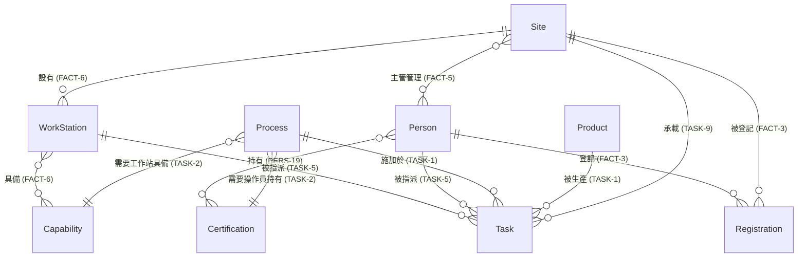

# 軟體設計文件（SDD, Software Design Document）：FMS_V3

**Factory Management System — TypeScript 全棧版** ｜ v1.0（2026-08-25）

> **這份文件回答「怎麼做」。** 「要滿足什麼」見 [`SRS.md`](SRS.md)——那份是驗收依據，
> 本檔是為了滿足它而選定的設計。教學材料（里程碑、踩坑地圖）見 [`GUIDE.md`](GUIDE.md)。
>
> **SRS 與 SDD 的分工**：SRS 實作中立（換技術棧仍成立），SDD 綁定技術棧。
> 本檔每一節都應能回答「這是為了滿足哪一條 TECH/FACT/TASK/PERS/ACC」。

| | 全名 | 內容 |
|---|---|---|
| [SRS.md](SRS.md) | Software Requirements Specification | 需求（做什麼）——逐條驗收 |
| **SDD.md**（本檔） | **S**oftware **D**esign **D**ocument | 設計（怎麼做）——架構與技術決策 |
| [GUIDE.md](GUIDE.md) | Course Guide | 教學（怎麼學）——里程碑、踩坑、Demo |

## 目錄

| § | 內容 | 對應需求 |
|---|---|---|
| 1 | 系統架構 | TECH-1~4 |
| 2 | 技術選型明細 | TECH-1~13 |
| 3 | 專案結構 | — |
| 4 | 權限模型（RBAC） | PERS-3~25 |
| 5 | 資料庫（PostgreSQL 17）使用規範 | TECH-3/4, TASK-6 |
| 6 | 測試策略與 CI | TECH-8 |
| 7 | SQL 資產化規範 | TECH-9, PERS-24 |
| 8 | UI 設計規範（Steel Blue） | TECH-6, ACC-5 |
| 9 | Docker Compose 部署規格 | TECH-13, ACC-7 |
| 10 | 未來擴充路線（不列入驗收） | — |
| 11 | 版本鎖定表（實測核實） | TECH-1 |
| 12 | 資料模型（ER 圖） | FACT-1~7, TASK-1~2 |

---

## 1. 系統架構

```
瀏覽器（Refine + Ant Design；vite dev 5173）
   │  /api/*（vite proxy 轉發到後端）
   ▼
Bun + Elysia 後端（3000）
   ├─ routes/     路由層：t schema 驗參 + JWT 解析 + 角色守衛
   ├─ services/   業務層：排程衝突檢核、證照/能力匹配、狀態機（In Planning→Scheduled→Finished）
   └─ db/         資料層：templates/（具名 SQL 模板：name + sql + params schema）
                        + pool.ts（pg 連線池單例）+ migrations/
   ▼  TCP 5432（連線池）
PostgreSQL 17 + pgvector（Docker 服務 `db`；資料在具名 volume `fms_pgdata`）
   └─ 測試用同一台 PG,每個測試檔開自己的 schema（見 §6）
```

分層鐵律：**路由不寫業務邏輯、業務層不碰 HTTP、SQL 只存在於 `db/templates/`**。
前端永遠只呼叫 REST API（resource + 參數），永遠不傳 SQL。

## 2. 技術選型明細（完整 TS 生態）

| 關注點 | 套件 | 用途 |
|---|---|---|
| Runtime / 套件管理 / 測試 | **Bun 1.4.0** | `bun install` / `bun run` / `bun test` 一把抓，免 Node+npm+jest 三件套 |
| 後端 HTTP | **elysia** + **@elysiajs/cors** | 路由、TypeBox 驗參、CORS |
| 前端框架 | **@refinedev/core** + **@refinedev/antd** | 資源導向 CRUD 框架（詳 §4） |
| UI 元件 | **antd 5.29.3**、**@ant-design/icons 5.6.1** | 表格/表單/週曆檢視全用現成元件（**不可升 antd 6**,見 §11） |
| 建置 | **vite** + **@vitejs/plugin-react** | 前端 dev server 與打包 |
| 資料庫 | **PostgreSQL 17**（映像 `pgvector/pgvector:0.8.6-pg17`） | 真 PG 伺服器,內建 pgvector（詳 §5） |
| DB 驅動 / 連線池 | **pg**（`node-postgres`） | **顯式**連線池（`new Pool` / `client.release()`）、參數化查詢——選它的理由見 §11 |
| 驗證 | **zod 3.x**（服務層）/ Elysia `t`（路由層） | 雙層驗證：邊界擋格式、服務擋語意 |
| 認證 | **jose** | JWT 簽發/驗證（HS256），httpOnly cookie |
| 密碼 | **Bun.password**（內建 argon2id） | 免額外套件 |
| CSV 匯入 | **papaparse** | PERS-15 三類 CSV 上傳解析 |
| 程式品質 | **typescript 5.9.3**（`tsc --noEmit`）、**biome**（lint + format 單一工具） | CI 三綠燈之二（**不使用 TS 7**,理由見 §11） |
| CI | **GitHub Actions** | push 即跑 `install → typecheck → test`（見 §6） |

> **完整鎖定版本見 §11 版本鎖定表（2026-08-25 實測核實）**——`package.json` 一律寫死
> 版本號不加 `^`;`bun.lock` 進版控,學員 `bun install` 即還原一致環境。

## 3. 專案結構（monorepo，單一 GitHub repo）

```
fms/
├── backend/
│   ├── src/
│   │   ├── index.ts          # Elysia 入口（掛 cors、cookie、路由群）
│   │   ├── routes/           # sites.ts / tasks.ts / registrations.ts / auth.ts / admin.ts / csv.ts
│   │   ├── services/         # scheduling.ts（衝突/證照/能力檢核）、tasks.ts、auth.ts
│   │   └── db/
│   │       ├── pool.ts       # pg 連線池單例（含測試用 schema 工廠）
│   │       ├── init/         # 首次建庫自動執行(compose 掛載到 docker-entrypoint-initdb.d)
│   │       ├── schema.sql    # 冪等建表（測試建 schema 時直接灌這支）
│   │       ├── migrations/   # 版本化 migration：001_init.sql, 002_*.sql…（只增不改）
│   │       └── templates/    # 具名 SQL 模板（每條：name + sql + zod params）
│   ├── tests/                # bun test（每檔開自己的 PG schema,見 §6）
│   ├── package.json
│   └── tsconfig.json
├── frontend/
│   ├── src/
│   │   ├── App.tsx           # Refine：resources、authProvider、accessControlProvider
│   │   ├── providers/        # dataProvider（打 /api）、authProvider、accessControlProvider
│   │   └── pages/            # tasks/ sites/ registrations/ admin/ public-board/
│   ├── package.json
│   └── vite.config.ts        # /api proxy → http://localhost:3000
├── testdata/                 # ACC-1 主測試集 + ACC-4 千筆任務集（CSV）
├── infra/                    # ★repo 已附:開發期環境(不是交付物)
│   ├── docker-compose.yml    #   db(PG 17 + pgvector) + minio
│   ├── .env.example          #   連線參數範本（真 .env 不進版控）
│   └── README.md             #   起手指令與疑難排解
├── docker-compose.yml        # ★由你撰寫:交付形態三服務(db + backend + frontend),ACC-7 驗這份
├── .github/workflows/ci.yml  # CI 起 postgres service container
└── README.md                 # 上手指令：起 db → bun install ×2 → 兩個 dev → 匯入測試集
```

## 4. 權限模型（RBAC）——Refine 對應 Django Admin 的作法

本專案有四種角色（詳 2.4）。Refine **沒有**「開箱即用的 Django admin」，但以三個 provider
組合可達到等價功能，且權限邏輯是顯式程式碼（教學上更透明）：

| Django 概念 | Refine 對應 | 本專案落法 |
|---|---|---|
| `ModelAdmin` 自動 CRUD 介面 | `resources` 宣告 + `List/Create/Edit/Show` 頁（可先用 **Inferencer** 自動生成再客製） | admin 區：users / sites / certifications / capabilities 四資源 |
| `User.is_staff` / 登入 | **`authProvider`**（login/logout/check/getIdentity） | 打 `/api/auth/*`，JWT 存 httpOnly cookie，`getIdentity` 回角色 |
| Model permissions（add/change/delete/view） | **`accessControlProvider.can({ resource, action })`** | 依 JWT 角色查權限矩陣（下表）；`can=false` 時 Refine **自動隱藏選單、禁用按鈕、擋路由** |
| admin site 只給 staff | resource 級 `can` + 後端路由守衛 | **前端擋 UX、後端擋安全**——後端守衛才是真防線（TECH-9），前端只是體驗 |

**權限矩陣（前後端共用同一份定義，放 `shared` 型別）**：

| resource × action | Admin | Site Manager | Operator | Anonymous |
|---|---|---|---|---|
| users / certifications / capabilities（CRUD） | ✅ | ✗ | ✗ | ✗ |
| sites（CRUD） | ✅ | 讀（僅所屬據點） | 讀 | 讀 |
| tasks：建立/指派/定案 | ✅ | ✅（僅所屬據點） | ✗ | ✗ |
| tasks：標記 Finished | — | — | ✅（僅被指派者） | ✗ |
| tasks：檢視 | ✅ | ✅（所屬據點） | ✅（已排程＋自身資格） | ✅（**操作員姓名匿名化**） |
| registrations（登記據點×週次） | ✅ | 讀 | ✅（自己的） | ✗ |
| CSV 匯入 | ✅ | ✅（所屬據點） | ✗ | ✗ |

> 進階選配：權限矩陣可改以 **Casbin**（`casbin` npm 套件）定義 model/policy，Refine 官方有
> accessControlProvider × Casbin 整合範例——教學上列為加分題，預設用上表的純 TS 矩陣即可。

##### 為什麼本課**不**採用「資料表驅動」的 RBAC

業界常見的 RBAC 做法是把權限存進資料庫（典型五張表：`user` / `role` / `permission` /
`role_permission` / `user_role`，再加一支 `check_user_permission(user, code)` 函式，
配 Redis 快取權限查詢結果）。這是**正確且成熟**的設計，規模大時該這樣做。

**但本課刻意不用**，理由是教學順序：

| | 資料表驅動 RBAC | 本課的 TS 權限矩陣 |
|---|---|---|
| 權限定義在哪 | 資料庫的列（要查表才知道） | **原始碼裡的一張表**（§4 上表，看得見） |
| 改權限 | 改資料 + 清快取 | 改程式碼 + 型別檢查會抓錯 |
| 新增角色 | 多筆 insert | 矩陣多一欄，**漏掉哪個 resource 編譯器會報** |
| 要多學 | 五張表 + 快取失效 + 遞迴查詢 | 無 |
| 適合 | 權限要**執行期由管理員調整** | 權限**在設計時就定死**（本課正是如此） |

FMS 的四個角色（Admin／Site Manager／Operator／Anonymous）是**需求寫死的**
（PERS-3~25），不需要執行期新增角色。這種情況下，把權限放進資料庫只會多一層間接、
多一個快取失效的 bug 來源，卻學不到更多東西。

**真正該學會的是這條鐵律，兩種做法都一樣**：
> **前端擋 UX、後端擋安全。** `accessControlProvider` 讓按鈕消失＝體驗；
> 後端每個端點自己的角色守衛＝安全。少了後端那層，權限模型再漂亮都是裝飾。

> 有興趣做資料表驅動 RBAC 的，列為**加分題**（與 Casbin 同級）——但**先把上表的矩陣
> 與後端守衛做完**再說。順序反了會兩頭空。

## 5. 資料庫（PostgreSQL 17）使用規範

- **是什麼**：**獨立的 PostgreSQL 17 伺服器**，由 Compose 的 `db` 服務提供，
  後端經 TCP 以連線池存取。映像用 `pgvector/pgvector:0.8.6-pg17`——就是官方 PG 17
  加裝 pgvector 擴充，現在不用向量也完全不影響，但將來要做向量檢索時**不必換映像、
  不必重建資料**（見 §10 未來擴充路線）。
- **為什麼用真 PG 而不是嵌入式資料庫**：這是**實戰經驗**的取捨。真 PG 伺服器帶來
  嵌入式庫學不到的四件事：
  1. **連線池**——連線是有限資源，池會滿、會逾時；`max` 怎麼設、連線何時歸還，
     是每個後端工程師都要會的。
  2. **真正的並行**——多請求同時打同一張表才會**真的**產生 race condition；
     嵌入式單連線是序列化的，race 根本重現不出來（下面第 4 點是本課的心臟）。
  3. **連線設定與機敏資訊管理**——host/port/密碼進環境變數、`.env` 不進版控，
     這是離開教室後每天都要面對的事。
  4. **可被外部工具連線**——psql、DBeaver、ETL 工具、BI 都能連進來看同一份資料；
     嵌入式資料庫做不到，而這正是資料能流向資料倉儲的前提（§10）。
- **連線規範**：
  - 後端以 **`pg` 連線池單例**（`db/pool.ts`，`new Pool({ max: 10 })`）存取，**禁止**每個請求
    開新連線;取得的 client **務必 `release()` 歸還**（用 `try/finally` 包）。
  - 連線參數一律走環境變數（`PGHOST`/`PGPORT`/`PGDATABASE`/`PGUSER`/`PGPASSWORD`），
    repo 只放 `.env.example`；**真 `.env` 不進版控**（TECH-9）。
  - SQL 一律參數化（`$1, $2…`），禁字串拼接（§7 鐵律 2）。
- **schema 演進**：`db/migrations/NNN_*.sql` 版本化累加，**只增不改舊檔**——
  改了舊檔，已經跑過的機器不會重跑，你的資料庫和同學的就長得不一樣了。
- **排程衝突的資料庫層防線（本課心臟）**：TASK-6（同據點同時段工作站/人員不可重疊）
  除服務層檢核外，加 **`EXCLUDE USING gist` 約束**當最後防線：

  ```sql
  -- btree_gist 必裝:gist 索引預設不支援純量欄位的 = 運算子
  CREATE EXTENSION IF NOT EXISTS btree_gist;

  ALTER TABLE tasks ADD CONSTRAINT no_overlap_work_station
    EXCLUDE USING gist (
      work_station_id WITH =,
      -- '[)' = 含頭不含尾:09:00-10:00 與 10:00-11:00 **不算**重疊(邊界接續是合法的)
      tstzrange(starts_at, ends_at, '[)') WITH &&
    ) WHERE (status <> 'Finished');
  ```

  操作員的重疊約束同理（`operator_id WITH =`）。
  > **兩個細節值得想清楚**：
  > ① `'[)'` 邊界——不寫的話預設也是 `[)`,但**明寫出來**代表你知道自己在決定
  >   「10:00 結束的任務和 10:00 開始的任務算不算撞」（答案:不算,這才合理）。
  > ② `WHERE (status <> 'Finished')` 是**部分索引**——已完成的歷史任務不該再
  >   擋住新排程。想一下這個判斷對不對,它會直接影響 ACC-4 千筆資料下的行為。
  > **換成真 PG 之後，這一條才真的可驗**：開兩個連線同時 INSERT 重疊時段，
  > 服務層檢查會**雙雙通過**，但資料庫會擋下其中一個（`23P01` exclusion_violation）。
  > 請寫一個並行測試證明它——這是「應用層檢查會有 race，資料庫約束才是底」
  > 從口號變成你**親手驗過**的事實。
  >
  > ✅ **上面這段已於 2026-08-25 在 PG 17.11 實測**：兩條連線同時搶同一工作站
  > 同一時段，**恰好一條成功**、另一條收到 `23P01`，資料表最終只有一筆;
  > 邊界接續（10:00 接 10:00）通過、與 `Finished` 任務重疊通過（部分索引生效）。
  > 完整紀錄見 [`../infra/README.md`](../infra/README.md)「實測紀錄」。

## 6. 測試策略與 CI

| 層 | 工具 | 內容 |
|---|---|---|
| 單元測試 | `bun test` | services 層：衝突檢核（時段重疊/跨日/超 6 小時/非 5 分鐘倍數）、證照/能力匹配、狀態機轉移、匿名化 |
| **並行測試** | `bun test` | **TASK-6 race**：兩條連線同時搶同一工作站同一時段 ⇒ 恰好一條成功、另一條收到 `23P01`（§5 心臟條款） |
| API 測試 | `bun test` + Elysia `handle()` | 路由層：驗參 400、未登入 401、越權 403、正常流 200 |
| 驗收展示 | `testdata/` 兩套 CSV | ACC-1 主測試集手動走流程；ACC-4 千筆集匯入後實測新增任務無可察覺變慢 |
| CI | GitHub Actions | 起 `postgres` service container → `bun install` → `tsc --noEmit`（前後端）→ `bun test`；main 分支保護：PR + CI 綠才可 merge |

**測試隔離：一個測試檔 = 一個 schema。** 換成真 PG 後不再有 in-memory 實例可用，
改用 PG 自己的 schema 當隔離單位——同一台 PG、各測試檔互不干擾，且**平行安全**：

```ts
// tests/helpers/db.ts
const id = `test_${crypto.randomUUID().replaceAll('-', '')}`;
await sql`CREATE SCHEMA ${sql(id)}`;
await sql`SET search_path TO ${sql(id)}`;
await sql.file('src/db/schema.sql');       // 在這個 schema 裡建表
// …測試結束
await sql`DROP SCHEMA ${sql(id)} CASCADE`;
```

**規範**：
1. 測試**禁止**連正式資料庫——CI 與本機都用獨立的 `fms_test` 資料庫（`.env.test`）。
2. schema 名用隨機字串，**不要**用測試檔名（同檔平行跑多個 case 會撞）。
3. `afterAll` 一定 `DROP SCHEMA … CASCADE`——忘了清，PG 裡會堆滿殘骸。
4. 測 race 的案例**必須開兩條真連線**（不能共用同一條）,否則測不到並行。

## 7. SQL 資產化規範（query-template，TS + Zod）

`db/templates/` 的每一條 SQL 都是**一等公民資產**，必須以下列介面宣告（不是散落在程式裡的字串）：

```ts
import { z } from 'zod';

export interface QueryTemplate {
  name: string;                        // 口徑名（人話，例：「週次任務清單」）
  source: string;                      // 溯源：對應本 SRS 的需求編號（例：'TASK-6, FACT-7'）
  sql: string;                         // 參數化 SQL（$1,$2… 或具名參數;禁字串拼接）
  params: z.ZodObject<z.ZodRawShape>;  // 參數 schema（執行前先 parse，不合法直接 400）
}

// 範例：某週某據點的已排程任務（匿名視角）
export const publicWeekTasks: QueryTemplate = {
  name: '公開看板-週任務',
  source: 'PERS-24, PERS-25',          // 匿名化+據點/週次篩選的需求出處
  params: z.object({
    site_id: z.number().int().positive(),
    year:    z.number().int().min(2020).max(2100),
    week:    z.number().int().min(1).max(53),   // ISO 8601（FACT-2）
  }),
  sql: `SELECT t.id, p.name AS product, pr.name AS process,
               ws.name AS work_station, t.starts_at, t.ends_at,
               'Operator ' || dense_rank() OVER (ORDER BY t.operator_id) AS operator_alias
        FROM tasks t
        JOIN products p   ON p.id = t.product_id
        JOIN processes pr ON pr.id = t.process_id
        JOIN work_stations ws ON ws.id = t.work_station_id
        WHERE t.site_id = $1 AND t.year = $2 AND t.week = $3
          AND t.status = 'Scheduled'`,
};
```

**四條鐵律**：
1. **`source` 必填**——每條 SQL 都要能回答「這條口徑是為了哪一條需求存在」；驗收時
   逐條需求可反查到實作（需求 ↔ SQL 雙向可追溯，這是本課程的工程紀律重點）。
2. **禁字串拼接**——參數一律 `$n` 佔位；`params` schema parse 失敗即 400（TECH-9/10）。
3. **前端永不傳 SQL**——REST API 只收 resource + 參數；模板名單即白名單。
4. **一模板一口徑**——同一數字兩處要用，抽同一條模板，不複製 SQL（口徑分叉是排程系統
   最貴的 bug）。

## 8. UI 設計規範（Steel Blue 主題）

整體視覺走**「深海軍藍側欄 + 鋼藍主色 + 冷灰藍亮內容區」**的企業風格（沉穩、專業、
長時間看表不累）。所有色票如下，實作時集中定義於 `frontend/src/theme.ts`，**禁止散寫**。

**（a）主色與內容區**

| token | 值 | 用途 |
|---|---|---|
| `colorPrimary` | **`#2E6DA4`**（鋼藍） | AntD 主色：按鈕/連結/選中態/focus |
| `appBg` | `#f4f6f9` | 頁面底（極淺冷灰藍，非純白非暖米） |
| `containerBg` | `#ffffff` | 卡片純白 |
| `textBase` / `textSecondary` | `#2a3442` / `#697485` | 深藍灰正文/次要字 |
| `border` / `tableHeader` | `#e2e8f0` / `#eef2f7` | 冷灰藍邊框/表頭 |

**（b）左側 Sidebar（恆深，不隨主題變亮）**

| token | 值 | 用途 |
|---|---|---|
| `sider.bg` / `sider.subBg` | **`#152a42`** / `#0f2033` | 深海軍藍底/子選單再深一階做層次 |
| `sider.text` / `textHover` | `#b3c4d9` / `#ffffff` | 未選中柔白偏藍/hover 純白（hover 底 `rgba(255,255,255,.07)`） |
| `sider.selectedBg` | **`#2e6da4`**（白字） | 選中=鋼藍實心塊 |
| `sider.border` / `groupTitle` | `#22405f` / `#6d84a0` | 內分隔線/群組標題 |

**Sidebar 行為（RWD 兩態）**：
- 桌面（≥992px）：Sider **常駐**，漢堡鈕在 **200px ↔ 80px（純圖示條）** 之間折疊；
- 窄屏（<992px）：Sider 改 **Drawer 抽屜**，漢堡鈕左滑出，點選單項後自動關閉；
- 選單分群依角色渲染（`accessControlProvider` 判定，見 §4）：任務排程／我的班表／
  公開看板／系統管理（僅 Admin 可見）;
- **Sider 底部＝使用者身分區**：登入者姓名＋角色＋所屬據點選擇器（Site Manager 多據點
  時可切，單據點鎖死）＋登出。

**（c）登入頁**（全深色，聚焦表單）

| 元素 | 規格 |
|---|---|
| 頁面底 | `#152a42` 滿版，`display:grid; place-items:center` 置中 |
| 卡片 | `max-width:380px`，底 `#1c3552`，`border-radius:12px`，陰影 `0 8px 32px rgba(0,0,0,.3)` |
| 標題 | 系統名，鋼藍 `#2e6da4`、22px、700;副標 `#94a3b8` 12px |
| 表單 | Email＋密碼（PERS-2）;label 淺灰藍 `#cbd5e1`;錯誤訊息具體（TECH-10）但**不揭露帳號是否存在** |
| 匿名入口 | 卡片下方連結「以訪客瀏覽公開看板 →」（PERS-23~25） |

**（d）頁內分類切換＝膠囊 Tabs（全站統一，不用 AntD 預設下劃線 Tabs）**

```css
/* pill-tabs.css：未選中=白底細邊膠囊;hover=鋼藍描邊;選中=鋼藍實心+白字 */
.pill-tabs > .ant-tabs-nav::before { border-bottom: none; }
.pill-tabs > .ant-tabs-nav .ant-tabs-ink-bar { display: none; }
.pill-tabs .ant-tabs-tab {
  background:#fff; border:1px solid #dfe8f1; border-radius:16px;
  padding:3px 14px; font-size:12px; color:#445;
}
.pill-tabs .ant-tabs-tab:hover { border-color:#2E6DA4; color:#2E6DA4; }
.pill-tabs .ant-tabs-tab-active { background:#2E6DA4; border-color:#2E6DA4; }
.pill-tabs .ant-tabs-tab-active .ant-tabs-tab-btn { color:#fff; font-weight:700; }
```

**設計驗收**：任何新頁面不得出現規範外色票；Tabs 一律套 `.pill-tabs`;
「同一件事全站長同一個樣子」列入 code review 檢核。

## 9. Docker Compose 部署規格（TECH-13）

> **開發期環境已附在 repo：[`../infra/`](../infra/)** ——只含 `db`（PostgreSQL 17 +
> pgvector）與 `minio`，`cd infra && docker compose up -d` 就有資料庫可用，
> 不必手動裝 PG。**該份已於 2026-08-25 實測通過**（兩服務皆 `healthy`、
> `down`/`up` 資料保留、`db/init/` 自動執行）——見 `infra/README.md` 實測紀錄。
>
> **但 `infra/` 不是交付形態。** 本節規格的三服務 compose（含 backend / frontend）
> 要**你自己寫在專案根目錄**，ACC-7 驗收跑的是那一份。兩份刻意分開：開發期天天改
> backend 不該連帶重建資料庫；驗收時要的則是「一鍵全起」。

單機（Docker Desktop）、**三服務**：`db`（PostgreSQL）＋`backend`（Bun/Elysia）＋
`frontend`（nginx 服務靜態檔並反代 `/api`）。只有 frontend 對外露 port。

```yaml
# docker-compose.yml
services:
  db:
    image: pgvector/pgvector:0.8.6-pg17    # PG 17 + pgvector（版本鎖死,見 §5）
    environment:
      POSTGRES_DB: fms
      POSTGRES_USER: fms
      POSTGRES_PASSWORD: ${POSTGRES_PASSWORD:?請在 .env 設密碼}   # ★不給預設值,逼你設
    volumes:
      - pgdata:/var/lib/postgresql/data     # ★具名 volume——容器重建資料不丟
    healthcheck:                            # ★backend 要等 db 真的可連,不是「容器起來」
      test: ["CMD-SHELL", "pg_isready -U fms -d fms"]
      interval: 5s
      timeout: 3s
      retries: 10
    # 不對外露 port:只有 backend 連得到。要用 psql/DBeaver 看資料時再自行加 ports

  backend:
    build: ./backend               # FROM oven/bun:1;bun install --offline（快取入 build context）
    environment:
      PGHOST: db
      PGPORT: "5432"
      PGDATABASE: fms
      PGUSER: fms
      PGPASSWORD: ${POSTGRES_PASSWORD:?}
    depends_on:
      db:
        condition: service_healthy          # ★等 healthcheck 過才啟動
    # 啟動時先跑 migrations 再開服務

  frontend:
    build: ./frontend              # 兩階段：oven/bun build(vite) → nginx:alpine 服務 dist
    ports: ["8080:80"]
    depends_on: [backend]

volumes:
  pgdata:
```

```nginx
# frontend/nginx.conf（反代要點）
location /api/ { proxy_pass http://backend:3000/; }   # 剝 /api 前綴 → 後端路由不帶前綴
location /     { try_files $uri /index.html; }        # SPA fallback
```

**規範**：
1. PG 資料一律在**具名 volume**（`pgdata`），**禁**放容器層；`down`/`up` 後資料須仍在
   （ACC-7 會實測）。注意 `docker compose down -v` 的 `-v` 會**刪掉 volume**——
   驗收前別手滑。
2. **密碼不進版控**：`POSTGRES_PASSWORD` 走 `.env`（repo 只放 `.env.example`）；
   compose 用 `${POSTGRES_PASSWORD:?}` 語法，**沒設就直接啟動失敗**，
   而不是靜靜用一個弱預設值跑起來。
3. **啟動順序**：`depends_on` 只保證「容器啟動」，不保證「PG 可連線」——
   必須配 `healthcheck` + `condition: service_healthy`，否則 backend 會在
   PG 還沒 ready 時連線失敗（附錄 B 坑 9）。
4. cookie 在 compose 拓撲下天然同源（瀏覽器只看到 :8080，`/api` 由 nginx 轉發）
   ——附錄 B 坑 7 的正解之二。
5. **離線四件套**：基底映像預載（`docker save oven/bun:1 nginx:alpine
   pgvector/pgvector:0.8.6-pg17 -o base.tar` → 教室機 `docker load`）＋ bun 離線快取
   入 build context ＋ lockfile ＋ `testdata/`——四者齊備即可斷網
   `docker compose up --build`。
   > ⚠ **PG 映像約 400MB，是四件套裡最大的一塊**——備課時務必先在教室機
   > `docker load` 驗過，別到上課才發現沒帶。
6. 驗收指令即文件：README 須含「`docker load` → 設 `.env` → `docker compose up -d`
   → 開 `http://localhost:8080`」四步，照打即通（ACC-7）。

## 10. 未來擴充路線（說明用，**不列入本次驗收**）

本節解釋「為什麼現在要換成真 PG」的長線理由。**這些都不是本次作業要做的**——
列在這裡是讓你知道今天的設計決策通往哪裡，不要為了未來過度設計今天的系統。

**今天的系統是 OLTP（線上交易處理）**：一次一筆任務的建立、指派、完成，
要求正確與即時。**資料分析是 OLAP（線上分析處理）**：跨月跨據點的稼動率、
瓶頸工作站、證照缺口——要掃大量歷史資料做聚合。

> **鐵律：不要在正式營運資料庫上跑大型分析查詢。** 一支掃三年歷史的聚合查詢
> 會拖垮正在排程的操作員。兩者要分開——這就是資料倉儲存在的理由，
> 也是 EXCL-2（報表功能不在範圍內）的技術背景。

**演進路徑**：

```
[今天] FMS 營運庫 (PG 17, OLTP)
          │
          │  ETL / CDC：定期或即時抽取
          ▼
[未來] 資料倉儲 (PG, OLAP)          ← 星型 schema:事實表(任務) + 維度表(據點/產品/製程/人員)
          ├─ pgvector：語意檢索與相似度
          └─ WrenAI：自然語言問資料("上個月哪個工作站最忙?")
```

| 元件 | 位置 | 做什麼 | 為何需要今天的真 PG |
|---|---|---|---|
| **ETL / CDC** | 營運庫 → 倉儲 | 定期抽取或以 logical replication 即時同步 | 嵌入式資料庫沒有 TCP 端點與 WAL,外部工具連不進來、也訂閱不到變更 |
| **pgvector** | 倉儲（本專案映像已內建） | 向量欄位與相似度檢索（如「找出類似的排程樣態」） | 已用 `pgvector/pgvector:0.8.6-pg17`,將來 `CREATE EXTENSION vector` 即可,**不必換映像、不必搬資料** |
| **WrenAI** | 倉儲之上 | 自然語言轉 SQL,對倉儲做聚合分析 | 需要一個它連得進去的標準 PG 端點,並依賴穩定的 schema 語意 |

**這條路線對你今天的作業有兩個實質影響**（都已寫進規格，做到即可）：

1. **SQL 模板的 `source:` 欄位**（§7 鐵律 1）——每條 SQL 都能反查需求編號。
   將來建倉儲時，「這個數字的口徑是什麼」有據可查；口徑分叉是資料倉儲最貴的 bug。
2. **一模板一口徑**（§7 鐵律 4）——同一個數字兩處要用就抽同一條模板。
   營運端口徑不一致，ETL 到倉儲只會把混亂放大。

> **GPU 運算（CUDA 等）不在資料庫層。** pgvector 在 PG 內做的是向量儲存與檢索；
> 若將來要做模型推論或大規模向量運算，那是**應用層**的事（獨立服務），
> 不會、也不該塞進 PG。這兩層別混為一談。

## 11. 版本鎖定表（**2026-08-25 實測核實**）

下表是**實際裝起來、跑起來、測過、打包過**的組合，不是查文件推論的。
`package.json` **一律寫死版本號（不加 `^` 或 `~`）**——教室三十台機器要長一模一樣。

**驗證方式**：以 Bun 1.4.0 全新安裝（無既有 lockfile）→ 執行 → `bun test` →
`tsc --noEmit` → `vite build`。結果：後端 **7/7 測試通過**、前端 **2/2 測試通過**、
前後端 typecheck 皆 **0 error**、Vite production build 成功（3,820 modules）。

**Runtime**

| 項目 | 版本 | 說明 |
|---|---|---|
| **Bun** | **1.4.0** | runtime + 套件管理 + 測試器三合一 |
| **PostgreSQL** | **17**（映像 `pgvector/pgvector:0.8.6-pg17`） | 見 §5 |

**後端（`backend/package.json`）**

| 套件 | 版本 | 用途 |
|---|---|---|
| `elysia` | `1.4.29` | 路由 + TypeBox `t` 驗參 |
| `@elysiajs/cors` | `1.4.2` | CORS |
| `pg` | `8.23.0` | PostgreSQL 驅動與**連線池**（見下方選型說明） |
| `zod` | `3.25.76` | 服務層驗證（**3.x,不是 4.x**） |
| `jose` | `6.2.10` | JWT 簽發/驗證（HS256） |
| `papaparse` | `5.7.0` | CSV 匯入（PERS-15） |
| `typescript` | `5.9.3` | **不使用 TS 7**（見下方「為何不升」） |
| `@types/bun` | `1.4.0` | 對齊 runtime |
| `@types/pg` | `8.23.1` | — |
| `@types/papaparse` | `5.3.16` | — |

> 密碼雜湊用 **`Bun.password`**（內建 argon2id），不需額外套件（PERS-2）。

**前端（`frontend/package.json`）**

| 套件 | 版本 | 用途 |
|---|---|---|
| `react` / `react-dom` | `18.3.1` | **React 18,不是 19**（Refine 4 不支援 19） |
| `antd` | **`5.29.3`** | **★不可升 6.x**（見附錄 B 坑 11） |
| `@ant-design/icons` | `5.6.1` | 與 antd 5 同代 |
| `@refinedev/core` | `4.58.0` | 資源導向 CRUD 框架 |
| `@refinedev/antd` | `5.47.0` | Refine × antd 綁定 |
| `@tanstack/react-query` | `4.44.0` | **Refine 的 peer,必須自己裝**（漏了執行期才爆） |
| `dayjs` | `1.11.23` | Refine antd 的 peer |
| `vite` | `6.4.3` | dev server + 打包 |
| `@vitejs/plugin-react` | `4.3.4` | 與 Vite 6 同代 |
| `typescript` | `5.9.3` | 與後端同版 |
| `@types/react` / `@types/react-dom` | `18.3.18` / `18.3.5` | 對齊 React 18 |

##### 為何是這一組（選型理由，值得讀）

**① 為何 `pg` 而不是 `postgres.js`。** `pg` 的連線池是**顯式**的——
`new Pool({ max: 10 })`、`client.release()` 你都看得見。本課要教「連線是有限資源」
（§5），用看得見的 API 才教得出來；把池藏起來的套件學不到這件事。

**② 為何 TypeScript 5.9.3 而不是最新的 7.x。** TS 7 能跑（實測過），但生態、教學文章、
Stack Overflow 答案都還沒跟上。**這門課的重點不是 TS 新特性,是排程邏輯**——
卡在工具鏈上的每一小時都是從業務邏輯偷來的。同理選 PG 17 而非 18。

**③ 為何 React 18 + Refine 4 而不是 React 19 + Refine 5。** 兩組都實測可用，但
React 18 + Refine 4 + antd 5 是目前教學資源覆蓋最厚的組合。**版本一致與查得到答案，
比版本新重要。**

**④ 為何 zod 3 而不是 4。** 與上述同代生態對齊；zod 4 的 API 有變動，範例與教學多數
仍是 3.x。

> **`bun.lock` 必須進版控。** 它才是「環境可重現」的唯一真相——助教在自己機器上
> `bun install` 必須還原出與你完全相同的版本樹。

##### 升級守則

課程期間**不要升級**。真要升，一次只升一個套件，且升完必須：
`bun install` → `bun test` → `tsc --noEmit` → `vite build` **四項全綠**才算數。
升級後 `bun.lock` 一起 commit。

---

## 12. 資料模型（ER 圖）

下圖是**依需求推導**的實體關係，欄位為示意（實際型別與約束由你決定）。
關鍵在**關係的多重性**——那是 FACT/TASK 條文的直接翻譯。



**主要欄位**（示意；實際型別與約束由你決定）：

| 實體 | 欄位 | 對應需求 |
|---|---|---|
| `Site` | `id` PK、`name` | FACT-1 |
| `Person` | `id` PK、`first_name`、`last_name`、`email` UK、`password_hash`（argon2id）、`role` | PERS-1, PERS-2 |
| `Product` | `id` PK、`name` | FACT-4（不可硬編碼） |
| `Process` | `id` PK、`name`、`certification_id` FK、`capability_id` FK | TASK-2 |
| `Certification` | `id` PK、`name` | TECH-11（不可硬編碼） |
| `Capability` | `id` PK、`name` | TECH-11（不可硬編碼） |
| `WorkStation` | `id` PK、`site_id` FK、`name` | FACT-6 |
| `Registration` | `id` PK、`person_id` FK、`site_id` FK、`year`、`week` | FACT-3、FACT-2（ISO 8601，week 1~53） |
| `Task` | `id` PK、`site_id` FK、`product_id` FK、`process_id` FK、`operator_id` FK、`work_station_id` FK、`year`、`week`、`starts_at`、`ends_at`、`status` | TASK-5/8/9、FACT-7、TASK-7 |

> 多對多關係（人↔證照、工作站↔能力）實作時是**中介表**
> （`person_certification`、`work_station_capability`）。

**讀圖重點（這三個是設計的核心，不是裝飾）**：

1. **`PROCESS` 是樞紐。** 它同時指向一張證照與一項能力——這一條讓 TASK-3（能力匹配）
   與 TASK-4（證照檢查）變成「查兩個 FK 是否對得上」，而不是散落各處的 if。
2. **兩個多對多**：人↔證照、工作站↔能力。實作時是中介表（`person_certification`、
   `work_station_capability`），**不要**在人員表塞一個 `certifications` 字串欄位。
3. **`REGISTRATION` 是 PERS-11 的守門員。** 指派任務前必須查得到
   「該操作員 × 該據點 × 該週次」的登記——沒登記就不能被指派。

> **`TASK` 上的約束不只 FK。** TASK-6（不重疊）靠 `EXCLUDE USING gist`
> （見 §5），TASK-7（時長）與 FACT-7（時窗）靠 CHECK 約束加服務層檢核。
> **ER 圖畫不出這些**——它只畫得出關係，畫不出規則。
