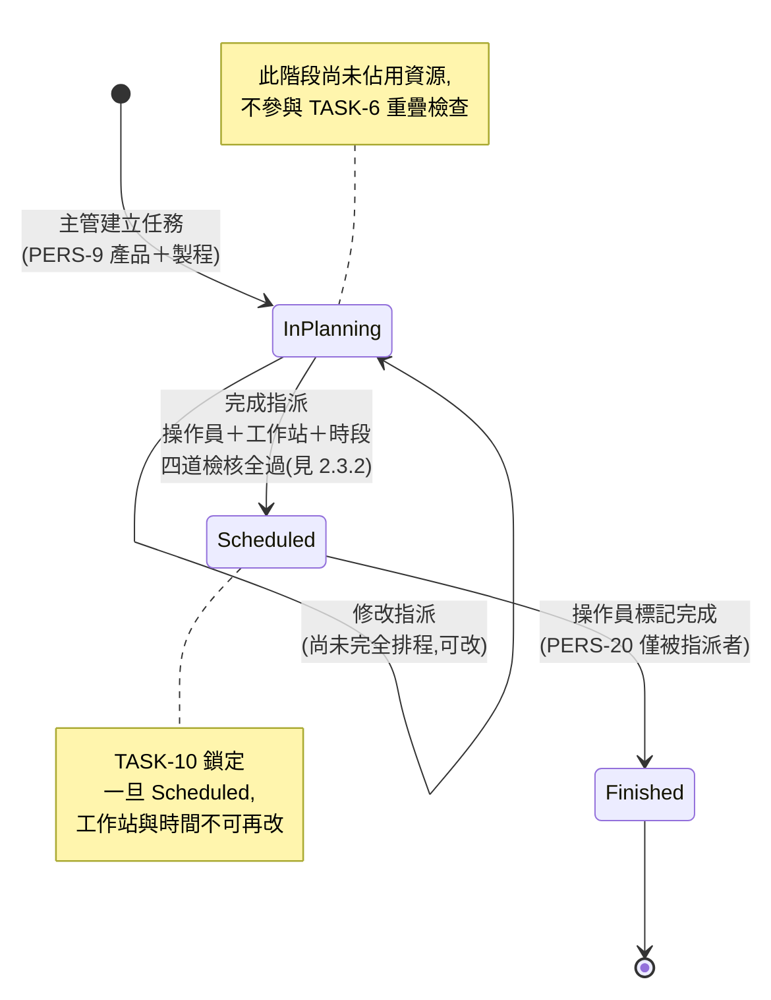
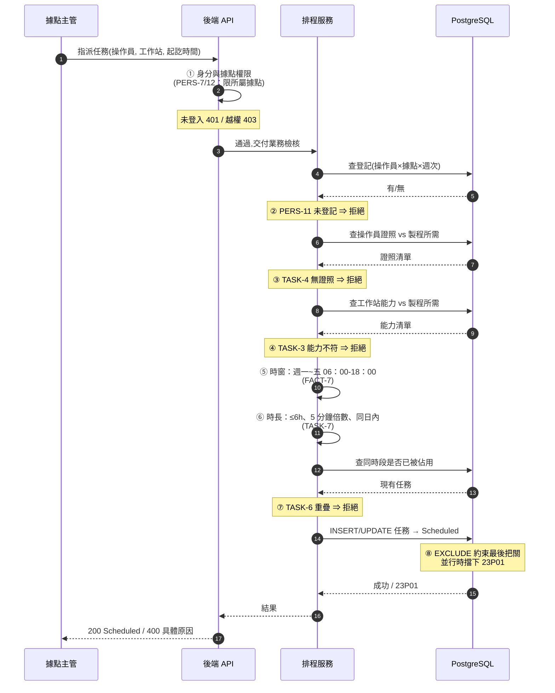

# 需求規格書（Lastenheft）：工廠管理系統（Factory Management System）

**程式設計專題 WI（Programming Project WI）** ｜ v4.0（2026-08-25）：TypeScript 全棧版（PostgreSQL 17）

---

> **本文件是 SRS（Software Requirements Specification，軟體需求規格書），只回答「系統要滿足什麼」。** 「怎麼做」（架構、技術選型、部署、UI 規範、
> 版本鎖定）已分離至 [`SDD.md`](SDD.md)；里程碑、踩坑地圖等教學材料見
> [`GUIDE.md`](GUIDE.md)。三份文件的需求編號（FACT/TASK/PERS/ACC）共用同一套。

| 文件 | 全名 | 回答 | 讀者 |
|---|---|---|---|
| **SRS.md**（本檔） | **S**oftware **R**equirements **S**pecification 軟體需求規格書 | 系統**要滿足什麼**——逐條可驗收 | 全部人，驗收依據 |
| [SDD.md](SDD.md) | **S**oftware **D**esign **D**ocument 軟體設計文件 | **怎麼做**——架構、選型、部署、規範 | 開工前與實作中 |
| [GUIDE.md](GUIDE.md) | Course Guide 課程指引 | **怎麼學**——里程碑、踩坑、Demo 劇本 | 學員與講師 |

> **為什麼要分這三份？** 業界慣例（IEEE 830 / ISO 29148）：SRS 描述**需求**，
> 必須「可驗證且實作中立」——同一份 SRS 換一套技術棧仍然成立（本專案 V2 與 V3
> 就是最好的例子：需求編號一字不差，技術棧完全不同）。SDD 描述**設計決策**，
> 技術棧一換就要重寫。兩者混在一起，改個套件版本就得動需求文件，
> 版本號會失去意義。

## 1. 概述（Overview）

工廠需要軟體來在多個據點之間排程生產任務。其挑戰特別包含：排程（scheduling）與工作站分配（work station allocation）。本專案要實作一套工廠管理系統，讓據點主管（site managers）能更輕鬆地規劃任務，並提供操作員（operators）一個簡易的方式來檢視並登記不同生產據點的每週班次。

生產規劃的工作流程依照以下步驟進行。在一個每週生產週期開始時，「產品（Products）」及其各自的「製程（Processes）」會被確認定案。操作員會針對特定的「生產據點（Production Sites）」與「週次（Weeks）」進行登記。據點主管依據這些登記，透過將產品與特定製程組合來決定任務（task）的指派。每一項任務都會分配一個工作站（work station）與一個時段（time slot），以確保：避免排程衝突、操作員持有該製程所需的證照（certification）、且工作站具備該製程所需的技術能力（technical capability）。任務完成後，操作員將該任務標記為「Finished（已完成）」，讓據點主管能夠監控進度與完成狀態。

詳細需求列於第 2 章。第 3 章描述不屬於本專案範圍，因此不需要被實作的元素。

---

## 2. 需求（Requirements）

### 2.1 技術規格（Technical Specifications）

本專案採用 **TypeScript 全棧**：前後端同一種語言、同一套型別，從資料庫到畫面端到端型別安全。

| 編號              | 內容                                                                                                                                  |
| ----------------- | ------------------------------------------------------------------------------------------------------------------------------------- |
| **TECH-1**  | 實作語言為 **TypeScript 5.9.3**（`strict: true`），執行環境 **Bun 1.4.0**（runtime + 套件管理 + 測試器三合一）；**版本一律照 [SDD.md](SDD.md) §3 鎖定表寫死** |
| **TECH-2**  | 後端框架：**Elysia**（REST API，路由層以內建 `t`（TypeBox）宣告請求 schema）；前端框架：**Refine + Ant Design**（React 18 + Vite）      |
| **TECH-3**  | 持久性資料儲存於一個 SQL 資料庫（**PostgreSQL 17**），資料表結構以冪等 SQL（`CREATE TABLE IF NOT EXISTS`）於啟動時建立；schema 變更以**版本化 migration 檔**累加（`db/migrations/NNN_*.sql`），不改舊檔 |
| **TECH-4**  | 資料庫使用**獨立的 PostgreSQL 伺服器**，以 Docker Compose 提供（映像 `pgvector/pgvector:0.8.6-pg17`＝PG 17 內建 pgvector）；後端經 TCP 以**連線池**（`pg`／node-postgres）存取；資料落在具名 volume，**不放容器層**。開發期不需在本機安裝 PG——repo 附 `infra/`，`cd infra && docker compose up -d` 即得（部署規格見 [SDD.md](SDD.md) §2） |
| **TECH-5**  | **開發期**用開發伺服器：先 `cd infra && docker compose up -d` 起資料庫，再 `bun run --watch src/index.ts`（後端）與 `vite`（前端，`/api` 反向代理到後端）；**交付與驗收必須以 Docker Compose 全棧啟動**（見 TECH-13、[SDD.md](SDD.md) §2）  |
| **TECH-6**  | 使用者介面以 React + Ant Design 元件實作（由元件庫產出語法正確的 HTML，不手寫裸 HTML/CSS）                                              |
| **TECH-7**  | 程式碼必須能在 Windows、macOS 與 Linux 上執行（Bun、Vite 跨平台無原生編譯依賴；PostgreSQL 統一走 Docker，三平台行為一致）                  |
| **TECH-8**  | 程式碼必須以單元測試（**`bun test`**）加以保護；排程衝突檢核等核心業務邏輯須有獨立測試                                                   |
| **TECH-9**  | 所有使用者輸入必須驗證：路由層 Elysia `t` schema + 服務層 **Zod**；SQL 一律**參數化**（`$1, $2…`，禁字串拼接）；認證採 **JWT（`jose`）存 httpOnly cookie（`SameSite=Lax` 防 CSRF）**；每個端點掛角色守衛防未授權存取 |
| **TECH-10** | 語意上不正確的使用者輸入必須以清楚的錯誤訊息加以拒絕（HTTP 400 + 人話訊息，不可回傳 stack trace）                                        |
| **TECH-11** | 系統必須具備可調整性（adaptable）；產品（products）、製程（processes）、證照（certifications）與據點（sites）不可硬編碼（hard-coded） |
| **TECH-12** | **完全離線可用，禁用任何 CDN**：所有依賴皆為 npm 套件由 Vite 打包（AntD 樣式與 icons 從套件 import，天生無 CDN）；字型用系統字型堆疊，**不得引用 Google Fonts / 外部字型**；教室部署以預抓好的 Bun 離線快取＋lockfile 還原（`bun install --offline`）；**PostgreSQL 映像須預先 `docker save` 帶進教室**（離線四件套見 [SDD.md](SDD.md) §2） |
| **TECH-13** | **必須能以 Docker Compose 部署於單機**（Docker Desktop）：repo 附前後端 `Dockerfile` + `docker-compose.yml`，`docker compose up -d` 一鍵啟動即可使用；**build 過程零外網**（依賴走 TECH-12 的離線快取），基底映像以 `docker save`/`docker load` 預載（部署規格見 [SDD.md](SDD.md) §2） |

> **技術實作規範全部移至 [`SDD.md`](SDD.md)**：系統架構、技術選型明細、專案結構、
> 權限模型、資料庫使用規範、測試策略、SQL 資產化規範、UI 設計規範、Docker 部署、
> 未來擴充路線、版本鎖定表。上表 TECH-1~13 是**需求**（要滿足什麼），
> SDD 是**設計**（打算怎麼滿足）。

### 2.2 工廠結構（Factory Structure）

| 編號             | 內容                                                                                                                                 |
| ---------------- | ------------------------------------------------------------------------------------------------------------------------------------ |
| **FACT-1** | 公司營運多個生產據點（Production Sites）                                                                                             |
| **FACT-2** | 生產據點以多個每週週期（Weekly Cycles）運作；一個每週週期以日曆週次（calendar week）與年份（year）依 ISO 8601 標準辨識               |
| **FACT-3** | 操作員為特定的生產據點與週次進行登記                                                                                                 |
| **FACT-4** | 每個週次包含「產品＋製程（Product+Process）」組合的生產任務（Production Tasks），可透過 CSV 或手動輸入提供；產品具有名稱且不可硬編碼 |
| **FACT-5** | 生產據點由一個或多個據點主管（Site Managers）管理                                                                                    |
| **FACT-6** | 工作站（Work Stations）位於據點內部，並由其與製程關聯的技術能力（Technical Capabilities）所定義                                      |
| **FACT-7** | 排程僅允許於週一至週五的 06:00 至 18:00 之間                                                                                         |

### 2.3 生產任務（Production Tasks）

| 編號              | 內容                                                                                                |
| ----------------- | --------------------------------------------------------------------------------------------------- |
| **TASK-1**  | 任務是「產品」與「製程」的組合。產品可以任意順序進行處理                                            |
| **TASK-2**  | 每一個製程都與一個給操作員的「證照（Certification）」以及一個給工作站的「能力（Capability）」相關聯 |
| **TASK-3**  | **能力匹配（Capability Match）**：任務只能被指派給具備該製程所需技術能力的工作站              |
| **TASK-4**  | **證照檢查（Certification Check）**：任務只能被指派給持有所需證照的操作員                     |
| **TASK-5**  | 任務必須排定給單一一位操作員與單一一個工作站                                                        |
| **TASK-6**  | 在同一據點且同一時間的任務，於工作站或人員使用上不可重疊                                            |
| **TASK-7**  | 任務不可超過 6 小時，且持續時間必須是 5 分鐘的倍數；任務必須在同一天內開始與結束                    |
| **TASK-8**  | 任務可處於「In Planning（規劃中）」、「Scheduled（已排程）」或「Finished（已完成）」三種狀態        |
| **TASK-9**  | 每一個任務都有一個指定的生產據點，且只能在該據點被排程                                              |
| **TASK-10** | 一旦完全排程完成，任務的工作站與時間就不可再變更                                                    |

### 2.3.1 任務狀態機（TASK-8, TASK-10）

**三個狀態的意義**（TASK-8）：

| 狀態 | 意義 | 誰能改 | 是否佔用資源 |
|---|---|---|---|
| **In Planning** | 已建立，尚未完全排程 | 據點主管（PERS-12：限所屬據點） | 否 |
| **Scheduled** | 已指派操作員＋工作站＋時段 | **不可再改**（TASK-10） | **是**（參與 TASK-6 重疊檢查） |
| **Finished** | 操作員回報完成 | 僅被指派的操作員（PERS-20） | 否（釋放時段） |

> **TASK-10 是硬規則，不是 UI 建議。** 「Scheduled 後不可改工作站與時間」必須由
> **後端**擋下——前端把按鈕變灰不算數。

### 2.3.2 任務指派的檢核順序（TASK-3~7, FACT-7, PERS-11）

指派是本系統最複雜的操作。下圖是**必須全數通過**的檢核；任一條失敗即拒絕，
並回傳清楚的錯誤訊息（TECH-10）。

**為什麼第 ⑦ 步和第 ⑧ 步要做兩次同樣的事？**

第 ⑦ 步（服務層查詢）是為了**給出好的錯誤訊息**——告訴主管「這個時段已被任務 #123 佔用」。
第 ⑧ 步（資料庫約束）是為了**正確性**——兩個主管同時指派同一工作站時，
第 ⑦ 步會**雙雙通過**（各自查詢時都還沒人佔用），只有資料庫約束擋得住。

> **這是本專案最重要的一課**：應用層檢查提供體驗，資料庫約束提供保證。
> 少了第 ⑧ 步，系統在單人測試時完全正常，上線後才會出現雙重預訂。

### 2.4 使用者群組（User Groups）

存在多種使用者群組：管理員（Administrators）、據點主管（Site Managers）、操作員（Operators）以及匿名使用者（Anonymous Users）。權限落法見 2.1.4 權限矩陣。

#### 2.4.1 一般「人員（Persons）」共通規定

| 編號             | 內容                                                                             |
| ---------------- | -------------------------------------------------------------------------------- |
| **PERS-1** | 所有人員（persons）都有名字（first name）、姓氏（last name）以及一個電子郵件地址 |
| **PERS-2** | 人員以電子郵件地址與密碼登入（密碼以 argon2id 雜湊儲存，見 TECH-9）              |

#### 2.4.2 管理員（Administrators）

| 編號             | 內容                                                                                     |
| ---------------- | ---------------------------------------------------------------------------------------- |
| **PERS-3** | 管理員必須登入系統                                                                       |
| **PERS-4** | 只有管理員能存取**管理介面**（Refine admin 資源頁：users / sites / certifications / capabilities 的 CRUD；`accessControlProvider` 擋前端、路由守衛擋後端，非管理員一律 403） |
| **PERS-5** | 管理員可檢視並修改所有資料（使用者、據點、能力）                                         |
| **PERS-6** | 管理員可新增使用者，並管理「證照（Certifications）」與「能力（Capabilities）」的全域清單 |

#### 2.4.3 據點主管（Site Managers）

| 編號              | 內容                                                                                                   |
| ----------------- | ------------------------------------------------------------------------------------------------------ |
| **PERS-7**  | 據點主管必須登入                                                                                       |
| **PERS-8**  | 被指派到特定的生產據點                                                                                 |
| **PERS-9**  | 為其所屬據點，透過組合「產品」與「製程」來建立任務                                                     |
| **PERS-10** | 透過將證照與能力對應到製程的需求，把操作員與工作站指派到所需的時段中                                   |
| **PERS-11** | 操作員必須登記同一據點與同一週次，才能被指派到任務                                                     |
| **PERS-12** | 據點主管僅能管理其所負責據點的任務與排程                                                               |
| **PERS-13** | 可檢視其所屬據點所有任務的狀態（In Planning、Scheduled、Finished）                                     |
| **PERS-14** | 將任務規劃定案（finalize），並鎖定每週排程                                                             |
| **PERS-15** | 可匯入下列項目的 CSV 上傳：工人（workers）的據點登記及其證照、工作站及其能力、每週每據點所需的生產任務 |

#### 2.4.4 操作員（Operators）

| 編號              | 內容                                                               |
| ----------------- | ------------------------------------------------------------------ |
| **PERS-16** | 操作員必須登入                                                     |
| **PERS-17** | 僅能檢視其所登記據點與週次中已完全排程的任務                       |
| **PERS-18** | 可依「據點」與「週次」篩選任務                                     |
| **PERS-19** | 為一個據點與週次進行登記；可依其持有的證照檢視自身有資格承接的任務 |
| **PERS-20** | 任務完成後，將其被指派的任務標記為「Finished」                     |
| **PERS-21** | 檢視自己的「已完成任務」歷史紀錄與目前持有的證照                   |
| **PERS-22** | 無法檢視其他操作員的詳細工作狀態                                   |

#### 2.4.5 匿名使用者（Anonymous Users）

| 編號              | 內容                                                             |
| ----------------- | ---------------------------------------------------------------- |
| **PERS-23** | 匿名使用者為未登入狀態                                           |
| **PERS-24** | 可看見生產據點的已排程任務，但操作員姓名須被匿名化（anonymized；匿名化在**後端**查詢層完成，前端拿不到原始姓名） |
| **PERS-25** | 可依「生產據點」與「週次」篩選任務                               |

### 2.5 驗收條件（Acceptance Criteria）

| 編號            | 內容                                                                                                        |
| --------------- | ----------------------------------------------------------------------------------------------------------- |
| **ACC-1** | 透過匯入一份主要的測試資料集（primary test dataset，置於 `testdata/`）來展示功能                            |
| **ACC-2** | 該資料集需包含 2 個以上的據點、2 個以上的每週週期，以及每週 3 個以上的任務                                  |
| **ACC-3** | 該資料集需包含至少三種製程類型、至少兩種證照，以及至少兩種工作站能力                                        |
| **ACC-4** | 第二份包含 1,000 個任務的測試資料集會被自動匯入。手動新增一個額外任務時，不可因資料量而出現可察覺的速度變慢 |
| **ACC-5** | 使用者介面（UI）以 **Ant Design 元件庫**達到最低限度的可用性（表格/表單/週曆檢視皆用現成元件，不手刻）      |
| **ACC-6** | **斷網驗收**：在完全無網路的環境下展示全部功能；瀏覽器 DevTools Network 面板不得出現任何外部網域請求（TECH-12） |
| **ACC-7** | **Compose 驗收**：於單機 Docker Desktop 上，照 README 四步（`docker load` → 設 `.env` → `docker compose up -d` → 開瀏覽器）啟動並走完附錄 C Demo 劇本；重建容器（`down`/`up`）後資料仍在（**具名 volume 驗證**） |

---

## 3. 範圍限制（Scope Limitations）

有些問題不在本專案的範圍內，為了簡化處理可以略過：

| 編號             | 內容                                                                     |
| ---------------- | ------------------------------------------------------------------------ |
| **EXCL-1** | 最佳化的排程演算法：系統僅驗證衝突，並不計算最佳排程                     |
| **EXCL-2** | 報表功能（KPI、稼動率儀表板等）不在範圍內                                |
| **EXCL-3** | 證照不會過期，且工作站不會因為維護而離線                                 |
| **EXCL-4** | 本系統不需實際寄送電子郵件                                               |
| **EXCL-5** | 庫存追蹤（Inventory tracking）與物料耗用不在範圍內                       |
| **EXCL-6** | 超出「每週登記」模式之外的操作員班別規則（例如加班、輪班輪替）不在範圍內 |

以上這些元素「可以」被實作，但並非必要。

---

## 附錄：Demo 劇本（10 分鐘驗收走位；學員自測與老師抽查同一份）

與 V2 版**完全同一份劇本**（同需求同流程）：
1. admin 登入 → 建 2 據點/3 製程/2 證照/2 能力（M1）
2. 操作員 A 登記「據點1×第 N 週」；操作員 B 不登記（M3）
3. 主管建任務→指派：選 B ⇒ **被擋**（PERS-11）；選無證照者 ⇒ 被擋（TASK-4）；選錯能力工作站 ⇒ 被擋（TASK-3）
4. 正確指派 A ⇒ Scheduled；再排同時段同工作站 ⇒ **衝突被擋**（TASK-6）
5. 排 19:00 或週六 ⇒ 被擋（FACT-7）；排 6.5 小時 ⇒ 被擋（TASK-7）
6. 操作員 A 登入 → 只看到自己已排程任務 → 標記 Finished（PERS-17, 20）
7. 登出 → 匿名開公開看板 → 看得到任務、**看不到真名**（PERS-24）
8. 匯入千筆集 → 手動再建一筆任務,無可察覺變慢（ACC-4）
9. 全程斷網,DevTools Network 零外部請求（ACC-6）

